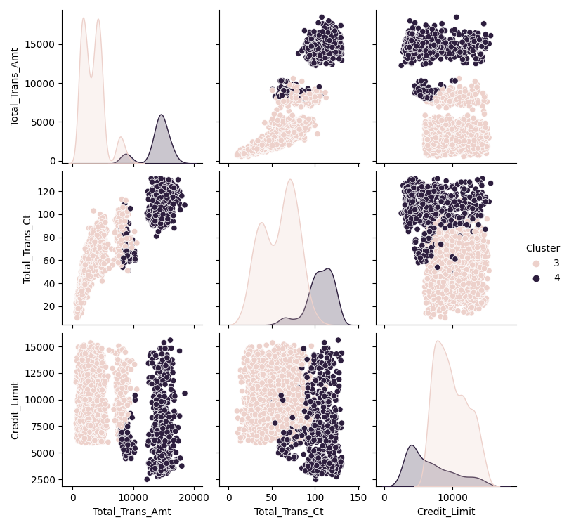

# Customer Churn Analysis

## Description

This project aims to predict customer churn for a financial institution and identify characteristics of potential churners. By analyzing customer data and building machine learning models, we aim to assist the marketing team in designing targeted campaigns to improve customer retention.

## Installation

To run this project locally, you need to set up a Python environment with the required dependencies. Follow these steps:

1. Clone this repository to your local machine.

2.  Create a virtual environment using the command: `python -m venv project-env`

3. Activate the virtual environment:
   - For Windows: `project-env\Scripts\activate`
   - For macOS/Linux: `source project-env/bin/activate`

4. Install the required packages: `pip install -r requirements.txt`

## Usage

This project is organized into different Jupyter notebooks, each serving a specific purpose. Here's how to use them:

1. **Data Preparation Notebook:** `notebooks/Data preparation.ipynb`
   - This notebook covers the initial data cleaning and preprocessing steps.
   - Open it to understand how the dataset was prepared for analysis.

2. **Model Building and Evaluation Notebooks:** 
   - `notebooks/LogisticRegression.ipynb`
   - `notebooks/DecisioTree.ipynb`
   - `notebooks/RandomForest.ipynb`
   - `notebooks/KNN.ipynb`
   - Each of these notebooks focuses on a specific machine learning model for customer churn prediction.
   - Open these notebooks to experiment with different models and evaluate model performance.

3. **Clustering Analysis Notebook:** `notebooks/clustering.ipynb`
   - Explore clustering techniques to group customers based on their behavior.
   - Understand the characteristics of different customer segments.
   - Explanation and analysis of our findings

To run any of these notebooks, open them using Jupyter Notebook or Jupyter Lab and execute the cells step by step. Make sure you have the required libraries and dependencies installed.

Feel free to experiment, modify, and contribute to different parts of the project based on your requirements.

## Analysis and Insights

In this project, we aimed to understand customer churn and retention patterns in the banking industry. By clustering our customer data into five distinct groups, we identified that Cluster 3 has the highest attrition rate and specific characteristics, including higher total transaction amounts and counts, as well as lower credit limits.

### Recommendation

To improve customer retention in Cluster 3, we suggest implementing tailored retention strategies. These could include adjusting credit limits, offering targeted promotions, and providing enhanced customer support to address the specific needs and concerns of this customer group.

These insights can guide the bank in making data-driven decisions to reduce customer churn and increase overall customer satisfaction.

---

For more details and code implementation, please refer to the project's notebooks in the `notebooks/` directory.

## Contributors
Fatemeh Loni

## Timeline
The project took approximately 4 days to complete.

## Personal Situation
This project was completed as part of the AI Bootcamp at BeCode.org.

⚠️ DATA SOURCES
The project uses the following data sources:

Bank Churners Dataset: 
[Credit Card Customers](https://www.kaggle.com/sakshigoyal7/credit-card-customers)

